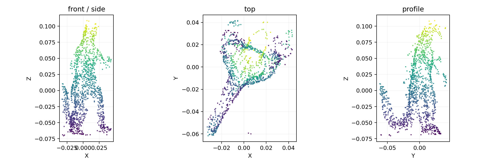
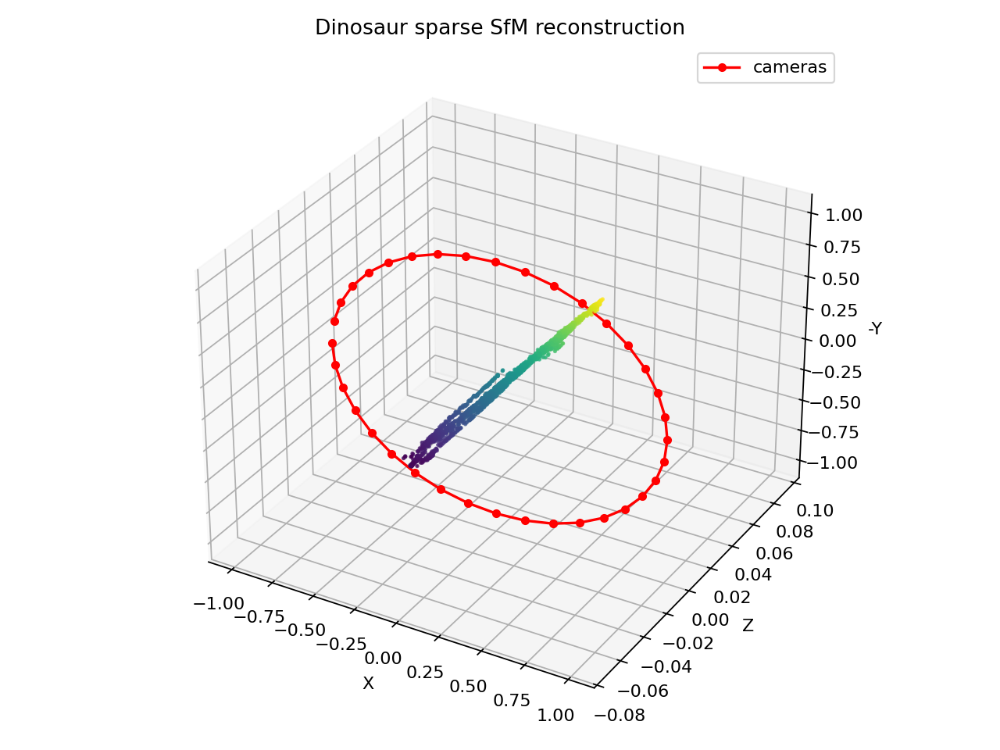
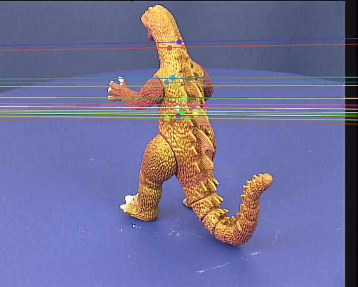

# 多视图几何作业：Dinosaur 三维重建

本项目实现的是一个基于 Oxford VGG Dinosaur Dataset 的多视图几何重建流程。代码主要围绕下面这条主线展开：

```text
多视角二维点轨迹
-> 基础矩阵 F
-> 本质矩阵 E
-> 相机姿态 R, t
-> 三角化三维点
-> 多视角点云优化
```

整个项目没有直接把官方三维结果当作答案，而是先用 tracked points 完成基础矩阵、本质矩阵、相机姿态和三角化这些核心步骤。后面为了让 Dinosaur 的轮廓更清楚，又加入了官方相机投影矩阵辅助的多视角三角化和重投影误差过滤。

## 1. 数据在代码中如何使用

Dinosaur Dataset 提供了一个 `viff.xy` 文件。它的每一行表示同一个空间点在 36 张图像中的二维坐标：

```text
x1 y1 x2 y2 ... x36 y36
```

如果某个点在某一帧不可见，对应坐标就是：

```text
-1 -1
```

在 `src/dinosaur.py` 中，代码用 `np.loadtxt()` 读取 `viff.xy`，并用下面两个函数整理匹配点：

- `observations_for_pair(tracks, view1, view2)`：取出两个视角中都可见的点，作为两幅图像之间的匹配点
- `observations_for_view(tracks, view)`：取出某个视角中所有可见的二维点，用于后续 PnP 位姿估计

这样做的好处是不用重新做 SIFT 匹配，因为数据集本身已经给出了跨多视角的 tracked points。代码可以更集中地验证多视图几何部分。

## 2. 基础矩阵 F 的估计

基础矩阵 `F` 描述两幅图像之间的极线约束：

```text
x2^T F x1 = 0
```

在 `src/geometry.py` 中，`estimate_fundamental()` 负责计算 `F`：

```python
F, mask = cv2.findFundamentalMat(
    pts1,
    pts2,
    method=cv2.FM_RANSAC,
    ransacReprojThreshold=ransac_threshold,
    confidence=0.999,
    maxIters=8000,
)
```

这里使用 RANSAC 是为了剔除不稳定的匹配点。`mask` 表示哪些点是内点，后面的姿态恢复和三角化只使用这些更可靠的点。

代码中还做了一步小优化：RANSAC 找到内点之后，再用这些内点重新估计一次基础矩阵：

```python
refined_F, _ = cv2.findFundamentalMat(
    pts1[inlier_mask],
    pts2[inlier_mask],
    method=cv2.FM_8POINT,
)
```

这样得到的 `F` 通常会比直接使用 RANSAC 输出更稳定。

## 3. 本质矩阵 E 的计算

基础矩阵是在像素坐标下描述极线几何，而本质矩阵是在归一化相机坐标下描述极线几何。它们之间的关系是：

```text
E = K^T F K
```

在 `src/geometry.py` 中，`essential_from_fundamental()` 完成这一步：

```python
E = K.T @ F @ K
```

因为真实数据中会有噪声，所以代码没有直接返回这个矩阵，而是调用 `_project_to_essential()`，用 SVD 把它调整成更接近真实本质矩阵的形式：

```python
U, singular_values, Vt = np.linalg.svd(E)
average = 0.5 * (singular_values[0] + singular_values[1])
E = U @ np.diag([average, average, 0.0]) @ Vt
```

这样处理的原因是，理想本质矩阵应该有两个相等的非零奇异值，第三个奇异值为 0。

## 4. 相机姿态 R, t 的恢复

有了本质矩阵以后，就可以从中恢复两台相机之间的相对旋转和平移方向。代码在 `recover_pose_from_essential()` 中调用 OpenCV：

```python
_, R, t, mask = cv2.recoverPose(E, pts1, pts2, K)
```

返回的 `R` 是旋转矩阵，`t` 是平移方向。这里需要注意，单目多视角重建本身存在尺度不确定性，所以 `t` 只能恢复方向，不能恢复真实物理长度。

## 5. 初始三维点的三角化

恢复出初始两帧的相机姿态后，可以构造两个投影矩阵：

```text
P1 = K [I | 0]
P2 = K [R | t]
```

在 `src/geometry.py` 中，`triangulate_with_poses()` 使用 OpenCV 的三角化函数：

```python
homog = cv2.triangulatePoints(P1, P2, pts1.T, pts2.T)
points = (homog[:3] / homog[3]).T
```

`cv2.triangulatePoints()` 得到的是齐次坐标，所以代码最后要除以第四维，转换成普通三维坐标。

## 6. 多视角增量式 SfM 的实现

`src/sfm.py` 中的 `reconstruct_dinosaur()` 是自己估计相机位姿的主流程。

它大致做了几件事：

1. ` _choose_initial_pair()` 从 36 个视角中选择一对公共点较多、视差较大的图像作为初始图像对。
2. 对初始图像对调用 `estimate_fundamental()` 得到 `F`。
3. 用 `essential_from_fundamental()` 得到 `E`。
4. 用 `recover_pose_from_essential()` 得到初始相机姿态 `R, t`。
5. 用 `triangulate_with_poses()` 三角化出第一批三维点。
6. 对后续视角，找到已经重建出的三维点和当前图像二维点之间的 3D-2D 对应关系。
7. 使用 `estimate_pose_pnp()` 调用 `cv2.solvePnPRansac()` 注册新相机位姿。
8. 新相机注册成功后，继续和已注册视角三角化新点。

这个流程就是一个简化版的增量式 Structure from Motion。

## 7. 为什么第一版点云不像恐龙

一开始只使用近似内参 `K` 和自己估计出来的相机位姿进行重建，虽然流程是完整的，但是点云看起来比较散，不太容易看出 Dinosaur 的形状。

主要原因有三个：

- 相机内参只是近似值，不是真实标定结果
- 没有做 bundle adjustment，全局相机位姿和三维点没有一起优化
- 只用部分视角注册和三角化，点云密度不够

所以第一版更适合证明 `F -> E -> R,t -> 三角化` 这条几何链路是跑通的，但展示效果不够好。

## 8. 点云效果是如何改进的

为了让最终模型更像 Dinosaur，我在 `src/multiview.py` 中加入了官方相机矩阵辅助的多视角三角化。

### 8.1 读取官方投影矩阵

`src/dinosaur.py` 中的 `load_camera_matrices()` 使用：

```python
data = loadmat(mat_path)
```

读取 `dino_Ps.mat` 中的 3x4 投影矩阵。每个投影矩阵都可以直接把三维点投影到对应图像上。

### 8.2 对每条 track 做多视角 DLT

在 `reconstruct_from_official_cameras()` 中，代码会遍历 `viff.xy` 的每一行。对于同一个 track，只要它在多个视角中可见，就把这些视角的投影矩阵和二维观测点收集起来。

真正求三维点的是 `triangulate_n_view()`。对于第 `i` 个视角，投影矩阵是 `P_i`，二维观测点是 `(x_i, y_i)`，代码构造两行 DLT 约束：

```text
x_i * P_i[2] - P_i[0]
y_i * P_i[2] - P_i[1]
```

多个视角的约束一起组成矩阵 `A`，然后用 SVD 求解：

```python
_, _, vt = np.linalg.svd(A)
homog = vt[-1]
point = homog[:3] / homog[3]
```

相比只用两幅图像三角化，多视角 DLT 使用了更多观测信息，所以三维点会更加稳定。

### 8.3 用重投影误差过滤漂浮点

三角化得到三维点后，代码不会直接全部保留，而是调用 `mean_reprojection_error()` 做检查。

它会把三维点重新投影回所有可见图像：

```python
projected = P @ homog
xy = projected[:2] / projected[2]
```

然后计算投影点和原始二维观测点之间的平均距离。如果误差太大，说明这个三维点不可靠，就直接丢掉。

代码中默认只保留平均重投影误差较小的点，因此可以明显减少点云中的离群点和漂浮点。

### 8.4 给点云上色

`src/reconstruction.py` 中的 `colorize_tracks()` 会根据 track 在图像中第一次可见的位置读取像素颜色，然后把这个颜色赋给对应三维点。

这样导出的 `PLY` 点云不是纯白点，而是带有图像颜色信息，观察起来更直观。

### 8.5 三视图展示

`src/visualization.py` 中的 `save_dinosaur_views()` 会把三维点分别投影到三个平面：

- `X-Z` 平面
- `X-Y` 平面
- `Y-Z` 平面

这样比单独看一个三维散点图更容易观察 Dinosaur 的身体、腿和尾巴轮廓。

## 9. 效果展示

### 三视角点云投影



### 优化后的点云和相机位置



### 初始图像对的极线结果



## 10. 总结

本项目先实现了多视图几何中最核心的 `F`、`E`、`R,t` 和三角化流程，说明可以从二维匹配点恢复相机姿态和稀疏三维结构。之后又使用官方相机投影矩阵进行多视角 DLT 三角化，并通过重投影误差过滤优化点云效果。

最终结果中，自己估计位姿的部分用于展示完整的几何计算过程，官方投影矩阵辅助的部分用于提升可视化效果。优化后的三视图中可以比较清楚地看到 Dinosaur 的整体轮廓。
