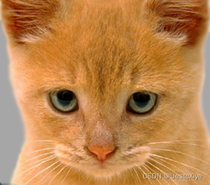
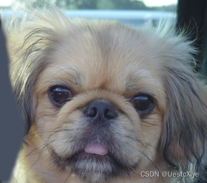
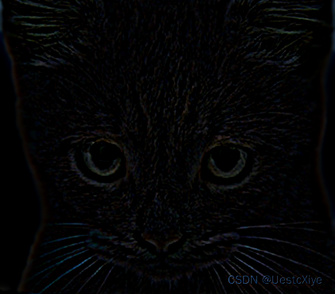
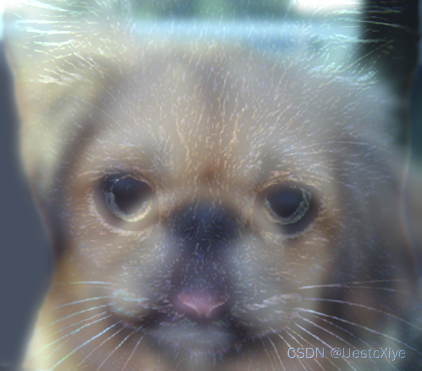

# Proj 1: Hybrid Image Fusion

## 项目简介

本项目实现了基于频率分解的图像融合。程序读取两张输入图像，将第一张图像提取为高频细节，将第二张图像提取为低频轮廓，再把两部分相加得到融合图像。近距离观察时，高频图像的纹理更明显；远距离观察时，低频图像的整体结构更突出。

## 项目结构

```text
1/
├── main.py                 # 主程序：读取图像、调用融合函数、保存结果
├── image_fusion.py         # 高频、低频提取与图像融合
├── utils.py                # 图像读取与尺寸统一
├── picture/
│   ├── cat.png             # 输入图像 A
│   └── dog.png             # 输入图像 B
└── output/
    ├── high_frequency.png  # A 图像的高频结果
    ├── low_frequency.png   # B 图像的低频结果
    └── fused.png           # 最终融合结果
```

## 代码如何实现

`main.py` 负责整体流程。首先通过 `utils.load_images()` 读取 `cat.png` 和 `dog.png`，然后使用 `resize_to_same()` 将两张图调整到相同尺寸，避免像素相加时形状不一致。

核心算法位于 `image_fusion.py`：

1. `extract_low_frequency()` 使用 `cv2.GaussianBlur()` 对图像进行高斯模糊，保留低频信息。
2. `extract_high_frequency()` 先对图像做高斯模糊，再用原图减去低频图，得到边缘、纹理等高频信息。
3. `fuse_images()` 将第一张图的高频与第二张图的低频通过 `cv2.add()` 相加，生成混合图像。

关键公式可以理解为：

```text
low = GaussianBlur(image)
high = image - GaussianBlur(image)
fused = high_A + low_B
```

代码中 `kernel_size=31` 控制高斯滤波窗口大小。窗口越大，低频图像越模糊，高频图像保留的细节越强。

## 运行方式

```powershell
cd D:\lyxxx\1
python main.py
```

运行后，结果会保存到 `output/` 目录。

## 数据可视化

输入图像如下：





高频结果展示了第一张图像中的边缘与纹理：



低频结果展示了第二张图像的整体轮廓：


最终融合结果：



## 实验总结

该项目展示了图像可以被分解为不同频率成分。高频信息主要对应细节、边缘和纹理，低频信息主要对应整体结构和亮度变化。通过组合不同图像的频率成分，可以得到具有双重视觉效果的 hybrid image。
