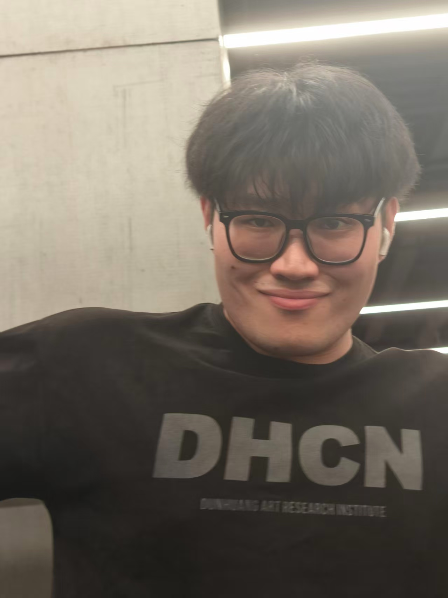
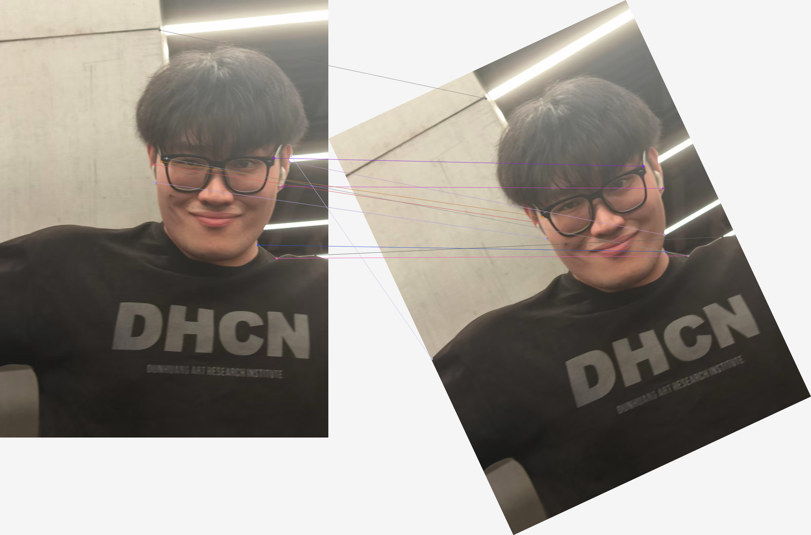

# Proj 2: Local Feature Matching

## 项目简介

本项目实现了局部特征检测、描述与匹配流程。程序读取一张图像，对其进行旋转变换，然后分别在原图和旋转图中检测 Harris 角点，提取 SIFT-like 描述子，并使用 Lowe ratio test 完成特征匹配。

## 项目结构

```text
2/
├── main.py                         # 命令行入口
├── requirements.txt                # 依赖库
├── picture/
│   ├── ren.jpg                     # 测试图像
│   └── mao.jpg                     # 测试图像
├── src/
│   ├── detector.py                 # Harris 角点检测
│   ├── descriptor.py               # SIFT-like 128维描述子
│   ├── matcher.py                  # 特征匹配与 ratio test
│   ├── pipeline.py                 # 完整处理流程
│   ├── image_utils.py              # 图像读取、旋转、坐标变换
│   ├── visualize.py                # 可视化绘制
│   └── keypoint.py                 # 关键点数据结构
└── outputs_ren_split/
    ├── input.png
    ├── rotated.png
    ├── input_keypoints.png
    ├── rotated_keypoints.png
    ├── rotated_projected_keypoints.png
    └── matches.png
```

## 代码如何实现

主入口是 `main.py`，它解析参数后调用 `src.pipeline.run_pipeline()`。完整流程如下：

1. `load_or_create_image()` 读取输入图像。
2. `rotate_image()` 按指定角度旋转图像，并保存旋转矩阵。
3. `harris_interest_points()` 在原图和旋转图中检测角点。
4. `sift_like_descriptors()` 为每个角点提取 128 维局部描述子。
5. `match_descriptors()` 计算描述子欧氏距离，并使用 Lowe ratio test 过滤错误匹配。
6. `draw_keypoints()` 和 `draw_matches()` 生成可视化结果。

Harris 角点检测使用如下响应函数：

```text
R = det(M) - k * trace(M)^2
```

其中 `M` 是由图像梯度构成的二阶矩矩阵。代码会先计算 Sobel 梯度，再通过高斯滤波得到局部结构矩阵，最后保留响应值较大且满足非极大值抑制的点。

SIFT-like 描述子使用每个关键点周围的 `16 x 16` 图像块，将其划分为 `4 x 4` 个 cell，每个 cell 统计 8 个方向的梯度直方图，因此最终描述子维度为：

```text
4 x 4 x 8 = 128
```

匹配阶段对每个描述子寻找最近邻和次近邻，如果最近距离小于 `ratio * 次近距离`，则认为该匹配可靠。

## 运行方式

安装依赖：

```powershell
cd D:\lyxxx\2
pip install -r requirements.txt
```

运行默认图像：

```powershell
python main.py
```

指定输入图像、旋转角度和输出目录：

```powershell
python main.py --image picture\mao.jpg --angle 25 --output outputs_mao
```

## 数据可视化

原始输入图像：



旋转后的图像：


原图 Harris 角点：


旋转图 Harris 角点：


将原图角点通过旋转矩阵投影到旋转图后的理论位置：


最终特征匹配结果：



## 实验总结

Harris 角点能够稳定检测图像中的局部结构变化，SIFT-like 描述子能够表达关键点附近的梯度分布。旋转图像后，仍能通过局部描述子找到部分稳定匹配点，说明该流程具备一定的旋转鲁棒性。ratio test 可以有效减少距离接近导致的错误匹配。
