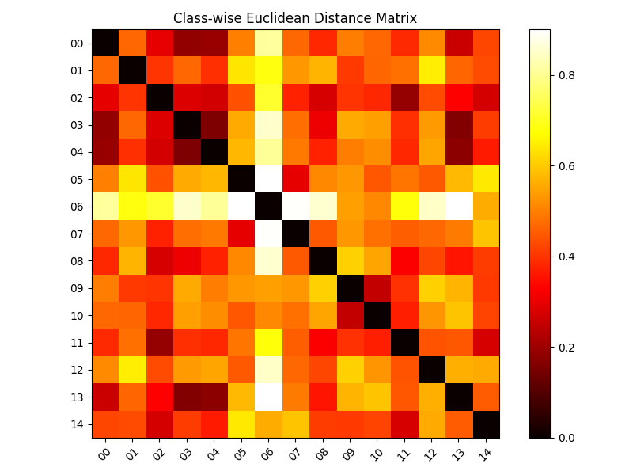

# Proj 3: Scene Recognition with Bag of Visual Words

## 项目简介

本项目实现了基于传统视觉特征的 15-Scene 场景识别。整体流程为：提取 SIFT 局部特征，使用 KMeans 构建视觉词典，将每张图像表示为 Bag of Visual Words 直方图，再通过 TF-IDF 加权和 SVM 分类器完成场景分类。

## 项目结构

```text
3/
├── build_vocabulary.py       # 构建视觉词典，并划分训练集/测试集
├── extract_features.py       # 提取单张图像的 BoVW 特征
├── train_classifier.py       # 训练 SVM 分类器
├── evaluate.py               # 在测试集上计算准确率
├── predict.py                # 随机抽取测试图像并展示预测结果
├── distance_matrix.py        # 绘制类别间距离矩阵
├── vocabulary.npy            # KMeans 聚类得到的视觉词典
├── idf.npy                   # TF-IDF 权重
├── svm_model.pkl             # 训练好的 SVM 模型
├── Figure_1.png              # 类别间欧氏距离矩阵
├── 屏幕截图 2026-06-02 104757.png # 随机预测结果截图
└── docs/images/class_samples.png  # 15-Scene 数据样例图
```

说明：已删除 `3` 文件夹中冗余的 `.venv`、`venv` 和 `__pycache__`，保留源码、数据、模型中间文件和可视化结果。

## 代码如何实现

### 1. 构建视觉词典

`build_vocabulary.py` 读取 `data/15-Scene` 下的 15 个类别，并使用 `train_test_split()` 按类别比例划分训练集和测试集。随后对训练图像提取 SIFT 描述子，并使用 `MiniBatchKMeans` 聚类得到视觉词典。

本项目设置：

```text
K = 200
```

也就是将大量 SIFT 局部描述子聚成 200 个视觉单词，保存为 `vocabulary.npy`。

### 2. 提取 BoVW 特征

`extract_features.py` 中的 `extract_bovw_feature()` 对单张图像执行以下步骤：

1. 使用 OpenCV SIFT 检测关键点并计算描述子。
2. 计算每个描述子到 200 个视觉词中心的距离。
3. 将描述子分配给最近的视觉单词。
4. 统计视觉单词出现次数，形成 200 维直方图。
5. 对直方图进行 L2 归一化。

因此，每张图像最终会被表示为一个 200 维向量。

### 3. TF-IDF 加权

`train_classifier.py` 会统计每个视觉单词在训练集中出现过的图像数量，并计算 IDF：

```text
idf = log((N + 1) / (df + 1)) + 1
```

其中 `N` 是训练图像数量，`df` 是某个视觉单词出现过的图像数量。TF-IDF 可以降低常见但区分度较弱的视觉单词权重，提高更有判别力的局部特征权重。

### 4. SVM 分类

分类器使用 `sklearn.svm.SVC`，配置如下：

```text
kernel = rbf
C = 10
gamma = scale
```

训练完成后，模型保存为 `svm_model.pkl`。`evaluate.py` 加载测试集、`idf.npy` 和 SVM 模型，计算测试集准确率。

## 运行方式

```powershell
cd D:\lyxxx\3
python build_vocabulary.py
python train_classifier.py
python evaluate.py
```

随机预测展示：

```powershell
python predict.py
```

类别距离矩阵可视化：

```powershell
python distance_matrix.py
```

## 数据可视化与输出结果

15-Scene 数据集样例图像如下，每个小图对应一个场景类别：


`distance_matrix.py` 生成的类别间欧氏距离矩阵如下。横纵轴是 15 个类别编号，颜色越亮表示两个类别的平均 BoVW 特征距离越大，颜色越暗表示特征越相似。



`predict.py` 的随机预测输出如下。每张图上方的 `T` 表示真实标签，`P` 表示预测标签，对勾表示预测正确，叉号表示预测错误。


## 实验总结

BoVW 方法能够用局部纹理和结构信息表示图像，并通过 SVM 完成场景分类。该方法训练成本较低、流程清晰、可解释性较强，但由于主要统计视觉单词频率，缺少空间布局信息，因此在视觉相似的类别之间容易混淆。类别距离矩阵和随机预测图可以帮助观察哪些类别特征更接近，以及模型在哪些样本上容易出错。
