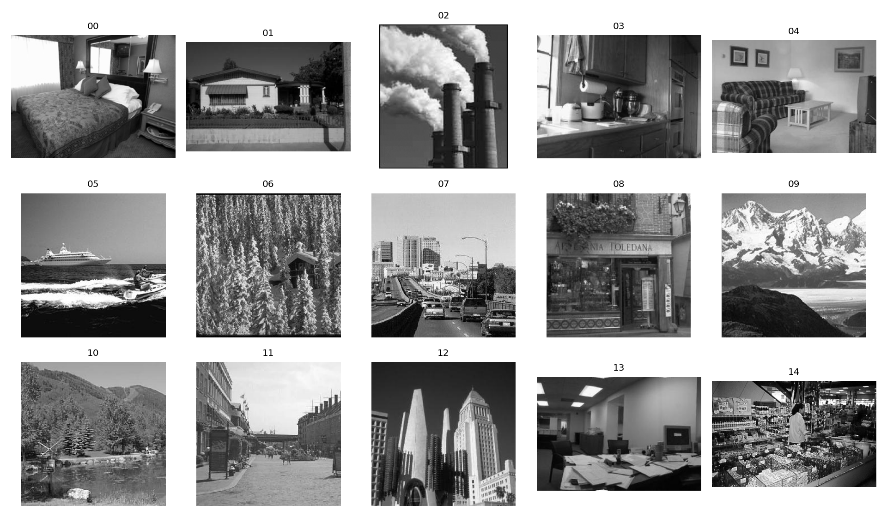

# Proj 3: Scene Recognition with Bag of Visual Words

## 项目简介

本项目实现了基于传统视觉特征的 15-Scene 场景识别。整体方法为 SIFT 特征提取、Bag of Visual Words 视觉词袋建模、TF-IDF 权重增强，以及 SVM 分类器训练。该方法不依赖深度学习模型，而是通过局部特征统计来表达整张图像。

## 项目结构

```text
3/
├── build_vocabulary.py       # 构建视觉词典并划分训练/测试集
├── extract_features.py       # 提取 BoVW 图像特征
├── train_classifier.py       # 训练 SVM 分类器
├── evaluate.py               # 测试集准确率评估
├── predict.py                # 随机抽样预测展示
├── distance_matrix.py        # 类别间距离矩阵可视化
├── vocabulary.npy            # KMeans 得到的视觉词典
├── idf.npy                   # TF-IDF 中的 IDF 权重
├── svm_model.pkl             # 训练好的 SVM 模型
├── train_paths.npy           # 训练集路径
├── test_paths.npy            # 测试集路径
├── train_labels.npy          # 训练集标签
├── test_labels.npy           # 测试集标签
└── docs/images/
    └── class_samples.png     # 数据集样例可视化
```

## 代码如何实现

### 1. 构建视觉词典

`build_vocabulary.py` 首先读取 `data/15-Scene` 下的 15 个类别，并使用 `train_test_split()` 按类别比例划分训练集和测试集。随后对训练集图像提取 SIFT 描述子，并用 `MiniBatchKMeans` 聚类得到视觉词典。

代码中设置：

```text
K = 200
```

表示将所有 SIFT 局部描述子聚成 200 个视觉单词，最终保存为 `vocabulary.npy`。

### 2. 提取 BoVW 特征

`extract_features.py` 中的 `extract_bovw_feature()` 会对单张图像执行以下步骤：

1. 使用 OpenCV SIFT 检测关键点并计算局部描述子。
2. 计算每个 SIFT 描述子到视觉词典中 200 个聚类中心的距离。
3. 将每个描述子分配给最近的视觉单词。
4. 统计 200 维词频直方图。
5. 对直方图进行 L2 归一化。

因此每张图像最终被表示成一个 200 维向量。

### 3. TF-IDF 加权

`train_classifier.py` 在得到所有训练图像的 BoVW 直方图后，统计每个视觉单词在多少图像中出现，并计算 IDF：

```text
idf = log((N + 1) / (df + 1)) + 1
```

其中 `N` 为训练图像数量，`df` 为某个视觉单词出现过的图像数量。TF-IDF 可以降低高频但区分度较弱的视觉单词权重，增强更有判别力的局部模式。

### 4. SVM 分类

分类器使用 `sklearn.svm.SVC`：

```text
kernel = rbf
C = 10
gamma = scale
```

训练完成后模型保存为 `svm_model.pkl`。`evaluate.py` 会加载测试集、`idf.npy` 和模型，计算测试集准确率。

## 运行方式

```powershell
cd D:\lyxxx\3
python build_vocabulary.py
python train_classifier.py
python evaluate.py
```

随机预测展示：

```powershell
python predict.py
```

类别距离矩阵可视化：

```powershell
python distance_matrix.py
```

## 数据可视化

15-Scene 数据集每个类别的样例图像：



`distance_matrix.py` 会计算每个类别 BoVW 特征均值之间的欧氏距离，并绘制热力图。颜色越亮表示类别间距离越大，颜色越暗表示类别特征更相似。

`predict.py` 会随机抽取 10 张测试图像，显示真实标签和预测标签，可用于观察模型在哪些场景类别上容易判断正确，在哪些视觉相似类别上容易混淆。

## 实验总结

该项目实现了传统图像分类流程：局部特征提取、视觉词典构建、图像直方图表达、特征加权和分类器训练。BoVW 方法能够较好地表达局部纹理和结构信息，但它忽略了空间布局，因此在视觉结构相似的类别之间容易产生混淆。相比 CNN 方法，传统方法训练成本较低，可解释性较强，但特征表达能力有限。
