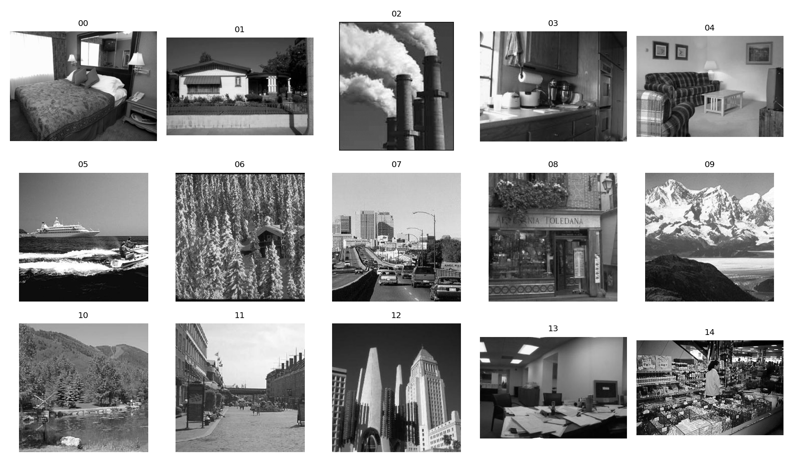

# Proj 4: Scene Recognition with Convolutional Neural Networks

## 项目简介

本项目使用卷积神经网络完成 15-Scene 场景分类任务。项目从基础 CNN 开始，逐步加入数据增强、归一化、Batch Normalization、Dropout、模型评估和可视化模块，最终形成从数据预处理、模型训练、预测展示到特征分析的完整流程。

## 项目结构

```text
4/
├── train_cnn.py       # CNN 模型训练与测试
├── test_model.py      # 随机抽取图像进行预测展示
├── visualize.py       # 混淆矩阵与 PCA 特征可视化
├── model.pth          # 训练好的模型权重
└── data/15-Scene/     # 15 类场景图像数据集
```

说明：项目迭代中设计了 `gradcam.py` 用于 Grad-CAM 可解释性分析，但当前目录中主要保留的是训练、测试和评估可视化三个核心脚本。

## 代码如何实现

### 1. 数据读取与预处理

`train_cnn.py` 使用 `torchvision.datasets.ImageFolder` 读取 `data/15-Scene`。目录名会自动作为类别标签。输入图像统一处理为：

```text
Resize((128, 128))
RandomHorizontalFlip()
ToTensor()
Normalize([0.5, 0.5, 0.5], [0.5, 0.5, 0.5])
```

其中 `Resize` 保证输入尺寸一致，`RandomHorizontalFlip` 用于数据增强，`Normalize` 将像素分布映射到更适合神经网络训练的范围。

### 2. CNN 网络结构

模型类为 `SimpleCNN`，包含三组卷积特征提取层和两层全连接分类器。

网络结构如下：

```text
Conv2d(3, 32, 3, padding=1)
BatchNorm2d(32)
ReLU
MaxPool2d(2)

Conv2d(32, 64, 3, padding=1)
BatchNorm2d(64)
ReLU
MaxPool2d(2)

Conv2d(64, 128, 3, padding=1)
BatchNorm2d(128)
ReLU
MaxPool2d(2)

Flatten
Linear(128 * 16 * 16, 256)
ReLU
Dropout(0.2)
Linear(256, num_classes)
```

输入图像大小为 `128 x 128`，经过三次 `2 x 2` 池化后变为 `16 x 16`，因此全连接层输入维度为 `128 * 16 * 16`。

### 3. 模型训练

训练配置如下：

```text
Epoch = 30
Batch Size = 64
Learning Rate = 0.001
Optimizer = Adam
Loss = CrossEntropyLoss
```

程序会自动检测 GPU：

```python
device = torch.device("cuda" if torch.cuda.is_available() else "cpu")
```

训练完成后，使用测试集计算准确率，并保存模型权重到 `model.pth`。

### 4. 预测与可视化

`test_model.py` 会加载 `model.pth`，随机抽取 10 张图片，显示 Ground Truth 和 Prediction，用于定性观察模型分类效果。

`visualize.py` 包含两个评估可视化：

1. 混淆矩阵：统计真实类别和预测类别的对应关系，用于分析哪些类别容易混淆。
2. PCA 可视化：提取 CNN 最后一层卷积特征，将高维特征降到二维空间，观察类内聚集和类间分离情况。

## 项目迭代过程

### Version 1：基础 CNN 实现

首先构建了一个简单卷积神经网络用于 15-Scene 场景分类。输入图像统一缩放至 `128 x 128`，初始训练配置为 `Epoch=20`、`Batch Size=64`、Adam 优化器和交叉熵损失函数。该版本成功完成训练，测试集准确率约为 59%。

### Version 2：引入数据增强与归一化

为了提高模型泛化能力，引入 `RandomHorizontalFlip`、`RandomRotation` 和 `Normalize`，并将训练轮数增加至 30。实验发现数据增强能够提高鲁棒性，但过强旋转会破坏部分场景结构，不合适的归一化参数也会导致精度下降，最低准确率曾下降至约 46%。

### Version 3：网络结构优化

在每个卷积层后增加 `BatchNorm2d`，用于稳定特征分布并加快收敛速度。全连接层中加入 `Dropout(0.2)` 降低过拟合风险，同时将全连接隐藏层调整为 256 维，减少模型复杂度。调整后模型收敛更加稳定。

### Version 4：训练参数调优

最终使用学习率 `0.001`、`Epoch=30`、`Batch Size=64` 进行训练，并在 RTX4060 GPU 上加速。训练过程中 loss 逐渐下降，测试准确率提高至约 67.67%，相比基础版本提升约 8 个百分点。

### Version 5：预测可视化模块

新增 `test_model.py`，用于加载训练完成的 `model.pth`，随机抽取 10 张图片，显示真实标签和预测标签。该模块用于定性分析模型分类能力。开发过程中发现，训练与测试阶段必须保持一致的数据预处理流程，否则会导致预测性能明显下降。

### Version 6：模型评估模块

新增 `visualize.py`，实现混淆矩阵和 PCA 降维可视化。混淆矩阵用于分析类别之间的误分类关系；PCA 将 CNN 提取的高维特征降到二维空间，用于观察类内聚集和类间分离情况。实验结果显示，大部分类别能形成一定聚类，但视觉相似类别之间仍存在重叠。

### Version 7：Grad-CAM 可解释性分析

迭代过程中设计了 Grad-CAM 可解释性分析思路，通过梯度加权方式生成热力图，用于观察 CNN 关注区域、分析模型决策依据，并提高模型解释性。对于森林、海岸、厨房等类别，Grad-CAM 可以帮助判断模型是否关注到了关键场景区域。

## 运行方式

```powershell
cd D:\lyxxx\4
python train_cnn.py
```

随机预测展示：

```powershell
python test_model.py
```

混淆矩阵和 PCA 可视化：

```powershell
python visualize.py
```

## 数据可视化

`test_model.py` 运行后会显示 10 张随机样本，并在每张图上标注真实类别和预测类别，可用于直观看出模型分类效果。

`visualize.py` 运行后会显示混淆矩阵。矩阵横轴表示预测类别，纵轴表示真实类别，对角线数值越高代表分类越准确；非对角线数值越高代表两个类别之间越容易混淆。

`visualize.py` 还会显示 PCA 特征散点图。每个点代表一张图像的 CNN 特征，不同颜色表示不同类别。类别内部越聚集、类别之间距离越远，说明模型学到的特征越有区分度。

15-Scene 数据集中部分类别样例如下：



## 实验总结

CNN 能够自动学习局部纹理、边缘结构和更高层的场景语义特征。相比 Proj 3 中的 BoVW 传统方法，CNN 的特征表达能力更强，最终准确率更高。但 CNN 对数据预处理、训练参数和模型结构更加敏感，需要通过数据增强、归一化、Batch Normalization 和 Dropout 等方法提升泛化能力。
